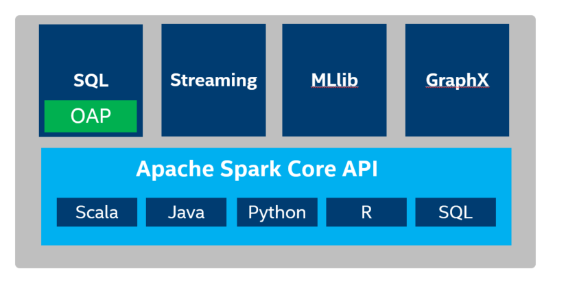
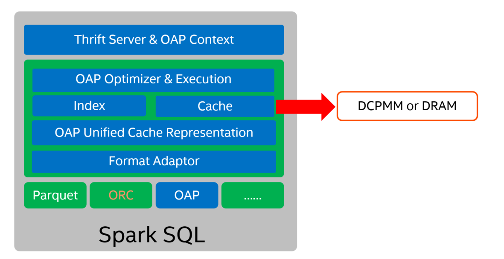

# OAP Architecture Overview

* [Introduction](#introduction)
* [OAP Architecture](#oap-architecture)
* [OAP Components](#oap-components)

## Introduction

Apache Spark is a fast and general-purpose cluster computing system. It provides high-level APIs in Java, Scala, Python and R, and an optimized engine that supports general execution graphs. It also supports a rich set of higher-level tools including Spark SQL for SQL and structured data processing, MLlib for machine learning, GraphX for graph processing, and Spark Streaming.

OAP is designed to leverage the user defined indices and smart fine-grained in-memory data caching strategy for boosting Spark SQL performance on ad-hoc queries.

## OAP Architecture

- OAP (Optimized Analytical Package for Spark) acts as a plugin jar for Spark SQL.  
- OAP implements unified cache representation adaptors for three fileformat: parquet, orc and oap(parquet-like columnar storage data format defined by OAP)  
- OAP's two major optimization functionality index & cache base on unified adaptors.
- Using Spark ThriftServer can unleash the power of OAP. Of course, using bin/spark-sql, bin/spark-shell or bin/pyspark also can.

Generally, the server's DRAM is used as the cache medium. [DCPMM](https://www.intel.com/content/www/us/en/architecture-and-technology/optane-dc-persistent-memory.html) can also be used as the cache mediu, it provide a more cost effective solution for high performance environment requirement.

The following diagram shows the OAP architect design 

By using DCPMM (AEP) as index and data cache, we can provide a more cost effective solutions for high performance environment requirement.

## OAP Components
### Index 

- BTREE, BITMAP Index is an optimization that is widely used in traditional databases. We also adopt this two most used index types in OAP project. BTREE index(default in 0.2.0) is intended for datasets that has a lot of distinct values, and distributed randomly, such as telephone number or ID number. BitMap index is intended for datasets with a limited total amount of distinct values, such as state or age.
- Statistics. Sometimes, reading index could bring extra cost for some queries。 So we also support four statistics(MinMax, Bloom Filter, SampleBase and PartByValue) to help filter. With statistics, we can make sure we only use index if we can possibly boost the execution.

### Cache
- OAP cache use Off-Heap memory and stay out of JVM GC. Also OAP cache can use [DCPMM](https://www.intel.com/content/www/us/en/architecture-and-technology/optane-dc-persistent-memory.html) as high-performance, high-capacity, low-cost memory
- Cache-Locality. OAP can schedule computing task to one executor which holds needed data in cache, by implementing a cache aware mechanism based on Spark driver and executors communication.
- Cache Unit. A column in one RowGroup (equivalent to Stripe in ORC) of a column-oriented storage format file is loaded into a basic cache unit which is called "Fiber" in OAP.
- Cache Eviction. OAP cache eviction uses LRU policy, and automatically cache and evict data with transparently to end user.
