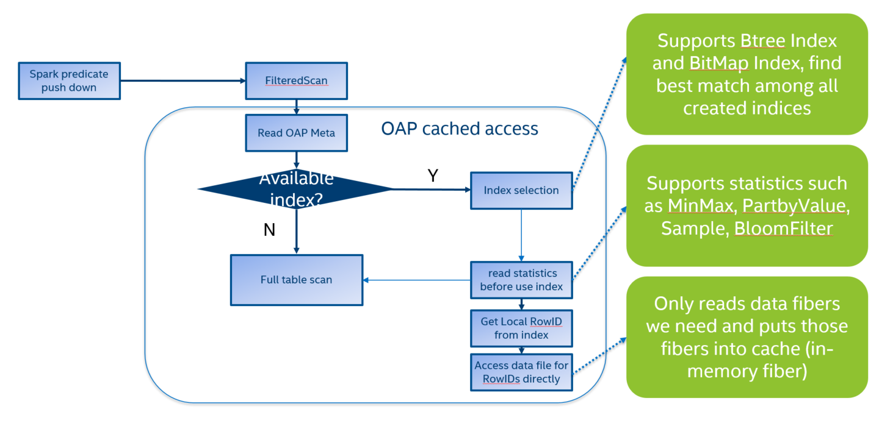
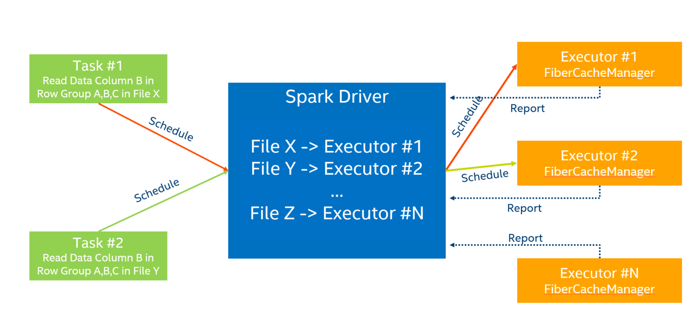
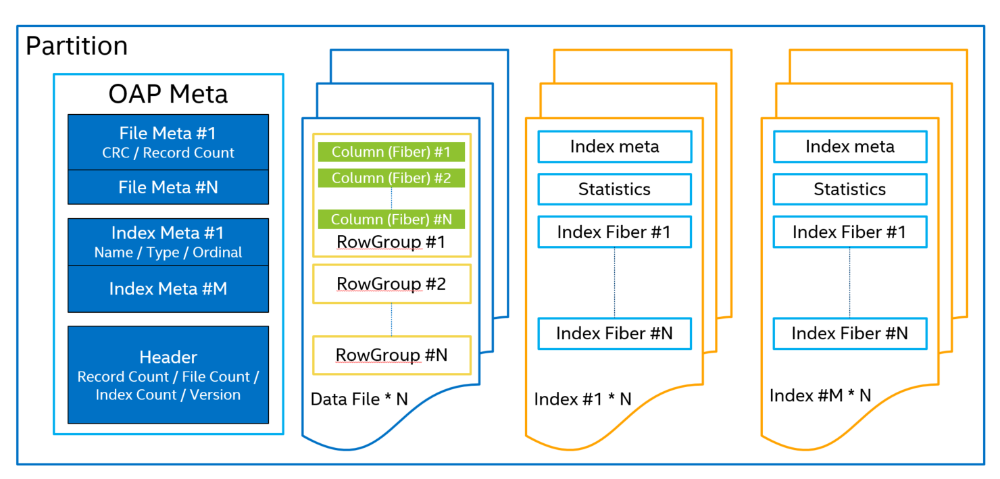

# OAP Design

* [Introduction](#introduction)
* [OAP Architecture](#oap-architecture)
* [OAP Components](#oap-components)

## Introduction

Apache Spark is a fast and general-purpose cluster computing system. It provides high-level APIs in Java, Scala, Python and R, and an optimized engine that supports general execution graphs. It also supports a rich set of higher-level tools including Spark SQL for SQL and structured data processing, MLlib for machine learning, GraphX for graph processing, and Spark Streaming.

OAP is designed to leverage the user defined indices and smart fine-grained in-memory data caching strategy for boosting Spark SQL performance on ad-hoc queries.

## OAP Architecture

- OAP (Optimized Analytical Package for Spark) acts as a plugin jar for Spark SQL.  
- OAP implements unified cache representation adaptors for three fileformat: parquet, orc and oap(parquet-like columnar storage data format defined by OAP)  
- OAP's two major optimization functionality index & cache base on unified adaptors.
- Using Spark ThriftServer can unleash the power of OAP. Of course, using bin/spark-sql, bin/spark-shell or bin/pyspark also can.

Generally, the server's DRAM is used as the cache medium. DCPMM can also be used as the cache mediu, it provide a more cost effective solution for high performance environment requirement.

The following diagram shows the OAP architect design 

By using DCPMM (AEP) as index and data cache, we can provide a more cost effective solutions for high performance environment requirement.

## OAP Components
### Index 

### Cache
Cache Aware

### OAPFileFormat

